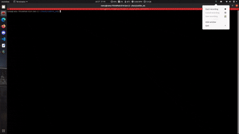

# Sub-Terrain Challenge: Introduction to Ros Autonomous Systems Group 15

**src foler link**: https://drive.google.com/drive/folders/10WdpjomrUJ2IHU_NK_Gq2OyMSFE94h_Y?usp=drive_link

## Video Demonstration


[Download Full Simulation Video (MP4)](https://gitlab.lrz.de/intro2ros_ramu_2025/intro2ros_ss25_g15/-/blob/main/Video_of_simulation.mp4)

## Installation

1. Start with a fresh Ubuntu 20.04 installation and C++
2. Install ROS Noetic: http://wiki.ros.org/noetic/Installation/Ubuntu, up to and including number 1.6:
    * Choose Desktop-Full Install in section 1.4
3. Install the following dependencies:
    ```bash
    sudo apt-get install ros-noetic-octomap-ros ros-noetic-octomap-msgs ros-noetic-octomap-server ros-noetic-octomap-rviz-plugins ros-noetic-ompl python3-catkin-tools git ros-noetic-roscpp ros-noetic-rospy ros-noetic-cv-bridge ros-noetic-sensor-msgs ros-noetic-std-msgs ros-noetic-image-transport ros-noetic-nav-2d-msgs ros-noetic-costmap-2d ros-noetic-map-server python3-pip python3-scipy 

4. Set up your SSH keys set up for Github. If you don't have them set up, follow these instructions:
    * To create an SSH
      keypair: https://docs.github.com/en/authentication/connecting-to-github-with-ssh/generating-a-new-ssh-key-and-adding-it-to-the-ssh-agent
    * To add the SSH key to your Github
      account: https://docs.github.com/en/authentication/connecting-to-github-with-ssh/adding-a-new-ssh-key-to-your-github-account
5. Clone this repository into a folder, we recommend using the `~/catkin_ws` folder as the root this repository.
    ```bash
    git clone https://gitlab.lrz.de/intro2ros_ramu_2025/intro2ros_ss25_g15.git
    ```
   If you decide to clone the repository into a different folder, make sure to replace `~/catkin_ws` with the path to
   the folder you want to clone the repository into.
6. Navigate to the catkin workspace folder and compile the codebase:
    ```bash
   catkin build
     ```
7. Source the workspace:
    ```bash
    source devel/setup.bash
    ```
8. Run the following command to launch the entire simulation, including the autonomy pipeline:
    ```bash
    roslaunch simulation combined.launch
    ```

## Repository Structure
This repository contains following ROS packages:

- `simulation/`
  - Contains a Unity-based simulation environment that mimics a vehicle's sensing and movement in a virtual city.
  - Includes launch files -combined.launch, configuration scripts, and integration logic.

- `perception_pkg/`
  - The perception system forms the sensory processing backbone of the autonomous vehicle, transforming raw sensor inputs into actionable environmental representations.

- `trafic_rule_pkg/`
  - This system integrates multi-modal sensor data to achieve robust traffic light state classification with distance estimation.

- `global_planner/`
  -This package constitutes the core component of the vehicle’s high-level path planning module.
  -Its primary function is to compute a complete global path prior to vehicle operation, based on a predefined set of nine waypoints and a known occupancy grid map of the environment. 

- `state_machine_pkg/`
  - It serves as the central decision making component for autonomous vehicle navigation,managing transitions between distinct operational states based on environmental inputs

- `local_planner_pkg/`
  - This package, plays a crucial role in enabling reactive, short-term path planning for autonomous vehicles operating in dynamic environments. 

- `trajectoryplanner_and_control_pkg/`
  - This package is responsible for translating the output of the local planner into actionable vehicle control commands, such as steering, acceleration, and braking. 

## Getting Started

### Clone the Repository to `/src` Folder in the Workspace

```bash
    git clone https://gitlab.lrz.de/intro2ros_ramu_2025/intro2ros_ss25_g15.git
```

Our Project Workspace looks like as shown below:

```text
intro2ros_ss25_g15/
└── src/
    ├── simulation/
    ├── perception_pkg (Ramkrishna Chaudhari)/
    ├── trafic_rule_pkg (Ramkrishna Chaudhari)/
    ├── global_planner (Muayad Chalabi, Youssef Ibrahim)/
    ├── local_planner_pkg (Bhaskar Sah)/
    ├── trajectoryplanner_and_control_pkg (Bhaskar Sah)/
    ├── state_machine_pkg (Ramkrishna Chaudhari)/
    ├── Controller testing and Stanley Controller attempt (Youssef Ibrahim) /
    ├── CMakeList.txt
    ├── setup_script.sh
    └── README.md
```

# Additional packages installed

- ros-noetic-octomap-ros
- ros-noetic-octomap-server
- ros-noetic-octomap-rviz-plugins
- ros-noetic-ompl
- python3-catkin-tools
- git
